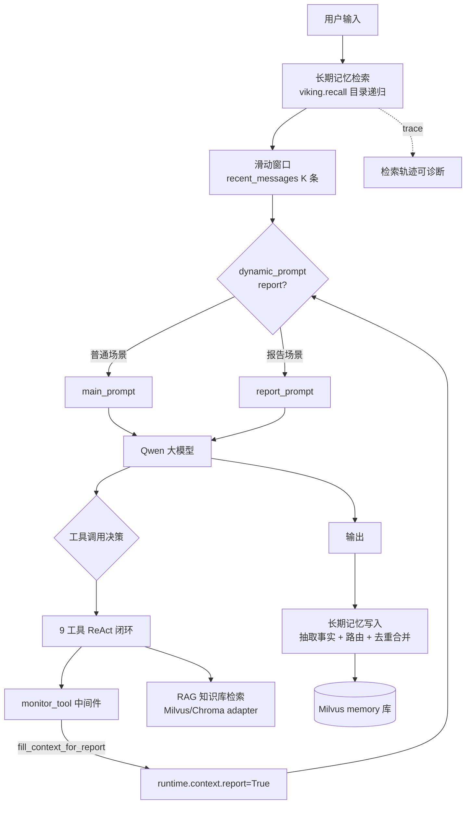

# OpsPilot · 企业 AIOps 智能运维问答系统

基于 LangGraph StateGraph 编排的 ReAct Agent，面向运维场景提供告警分析、监控指标诊断、日志根因定位与系统运行报告生成。系统使用通义千问 Qwen 作为核心模型，通过 LangChain 1.x 的 `create_agent` + middleware 机制组装工具调用闭环。

## 核心设计

系统有四个关键设计点，分别解决传统运维 Agent 在实际落地时的四类问题：

| 设计 | 解决的问题 |
|---|---|
| 双场景动态提示词 | 一套 Agent 兼容普通问答与结构化报告，不维护两套提示链 |
| 信号工具声明场景 | 场景识别从自然语言判断改为确定性工具调用信号 |
| 两层记忆系统 | 短期对话上下文与跨会话事实的分类治理 |
| viking 分层检索 | 扁平 top-k 召回不可诊断，召回失败无法定位 |

## 架构



## 一、双场景动态提示词

普通问答与报告生成是两种截然不同的输出范式。前者要求模型针对当前问题给出诊断结论，后者要求按固定结构（运行概览 / 关键指标 / 异常事件 / 处置建议）输出 Markdown 报告。

实现上通过 `@dynamic_prompt` 中间件 `report_prompt_switch` 完成：每次模型调用前读取 `runtime.context["report"]` 字段，在 `main_prompt` 与 `report_prompt` 之间切换系统提示词，两套提示词文件路径配置在 `config/prompt.yml`。这样不需要维护两个独立 Agent，场景切换发生在中间件层，对上层完全透明。

## 二、信号工具设计：`fill_context_for_report`

报告场景的触发来自 Agent 自身的工具调用决策，而不是关键词匹配：

- `fill_context_for_report` 是一个无入参、无副作用的 `@tool`
- `monitor_tool`（`@wrap_tool_call`）中间件在拦截阶段识别该工具被调用，置 `runtime.context["report"] = True`
- 下一轮 `@dynamic_prompt` 据此切换到报告提示词

这样做的收益是把"场景识别"从脆弱的自然语言判断变成了确定的工具调用信号。自然语言判断的失败模式是隐性的（"分析一下"和"生成报告"对模型来说边界模糊），工具调用是显式的、可观测的、可测试的。要扩展到更多场景，再挂一个对应信号工具 + 中间件分支即可。

## 三、9 工具 ReAct 闭环

| 工具 | 作用 |
|---|---|
| `rag_summarize` | 向量库检索运维知识 |
| `get_target_service` / `get_time_range` | 补全分析目标（服务名/时间范围） |
| `fetch_alert_data` | 告警信息 |
| `fetch_metric_data` | CPU/内存/QPS/RT/错误率等监控指标 |
| `fetch_log_summary` | 高频错误与日志摘要 |
| `fetch_service_topology` | 上下游依赖与中间件拓扑 |
| `fetch_report_data` | 聚合报告数据 |
| `fill_context_for_report` | 信号工具，触发报告场景 |

数据工具当前对接 mock 数据（`agent_tools.py` 内置），接口已抽象，后续可替换为真实 Prometheus / Elasticsearch / 告警平台数据源。

## 四、两层记忆系统：短期对话上下文 + 跨会话事实

记忆分两层，对应两种本质不同的需求：

- **短期记忆** 管的是"本次会话刚刚发生了什么"，按时间序取最近 K 条
- **长期记忆** 管的是"这个用户/这个场景历史上发生了什么"，按相关度召回

### 4.1 短期记忆（`agent/memory.py`）

**实现**：`FileChatMessageHistory` 继承 LangChain 的 `BaseChatMessageHistory`，每个 `session_id` 对应一个 JSON 文件，全量历史持久化，进程重启不丢失。

**取法**：`recent_messages(K)` 返回尾部 K 条。模型每轮拿到的不是全量历史，而是最近 K 条历史 + 本轮 query。

**K = 20 的权衡**：

- 太小（< 5）：多轮工具调用的上下文丢失（比如用户先问"order-service 的告警"，Agent 调了 `fetch_alert_data`，再问"那它的指标呢"——上下文丢了就回答不了"它"指谁）
- 太大（> 50）：长对话在 Long Context 下 token 成本陡增，且历史噪声会稀释当前 query 的语义权重
- 20 条 ≈ 10 轮 Human+AI 对，覆盖一次运维排查的典型多轮交互

**为什么不直接用 `RunnableWithMessageHistory`**：它默认全量喂回，长对话直接撞上下文窗口；手写 `recent_messages` 切尾部后，全量历史仍在磁盘上、语义不丢，只是不喂给模型。

### 4.2 长期记忆（`agent/memory_store.py` + `agent/viking/`）

参考 [mem0](https://github.com/mem0ai/mem0) 的设计但不引入其完整依赖，采用轻量实现。分管上：**mem0 管数据进入的治理，viking 管数据的组织与取**。

#### 进入侧：两阶段流水线 + 增量 upsert

1. **抽取**：LLM 从本轮对话抽取"值得长期记住的原子事实"（用户偏好、决策、关键运维结论如根因定位）
2. **更新**：新事实向量化检索最相似已有事实，LLM 决定四操作之一 —— `ADD`（新信息）/ `UPDATE`（同对象新状态）/ `MERGE`（合并更完整）/ `DELETE`（重复冗余）

事实原文以 JSON 为 source of truth，Milvus 向量库作为检索索引。写入侧采用增量 upsert：`fact_id` 作为主键，新增只插不重建，删除只按 `fact_id` 差集删陈旧条目，不再 drop collection 全量重插。

#### 组织侧：viking 分层记忆

mem0 解决了"数据怎么进去"，但"数据怎么取"仍是扁平 top-k——条目一多，召回归谁、失败在哪一步都不可见。viking 补上组织与取：

- **虚拟文件系统**（`viking_fs.py`）：`memories/` 下 6 个分类目录（user_profile / incidents / solutions / preferences / decisions / misc）。每条记忆自带三级：L0 ≤256 字（供向量定位）、L1 ≤4000 字概览（默认终点）、L2 原文（按需下钻）。目录级另有 `.abstract.md` / `.overview.md` 两级摘要，写入只打 dirty 标记，读取时惰性刷新。
- **意图分析**（`intent_analyzer.py`）：把 query 拆成 0-5 个 `TypedQuery`（MEMORY / RESOURCE / SKILL 三类根目录 + intent + priority）。中文疑问词（怎么/如何/为什么…）也算提问，口语里没人打问号，只判 `?` 会把真问题降级成简单查询。
- **目录递归检索**（`directory_retrieval.py`）：先扫目录级 L0 阈值过滤定位多个目录 → 目录内扫条目级 L0 → 下钻 L1（不够再 L2）→ 聚合。阈值过滤而非只取 top-1，"磁盘满怎么解决"可以同时命中 incidents 和 solutions。
- **写路径治理**（`memory_viking.py`）：hash 硬去重 → LLM 分类路由 → **限定同目录**算相似度（0.92 丢弃 / 0.85 触发 LLM 合并）→ 合并后重新路由（语义可能变）。目录级 L0 刷新后同步回索引，否则刚写入的记忆在下次检索时连目录入口都没有。
- **可诊断性**：全程留 retrieval trace（五步 + 浏览路径），召回失败会留下 `step3_miss`，排查时直接看是哪个目录的 L0 写得不好。

### 4.3 长短期记忆如何拼进 prompt

```python
full_messages = history.recent_messages(20)                # 短期：时间序尾部 K 条
recalled = viking.recall(query, k=3)                        # 长期：相似度召回 K 条事实
full_messages = [SystemMessage(recalled)] + full_messages  # 长期事实以 SystemMessage 注入并前置
```

- 长期事实用 `SystemMessage` 注入而非 `HumanMessage`，避免被模型当成"用户新指令"
- 放在最前面，让短期对话历史紧跟其后，最末是本轮 query ——模型注意力对尾部更敏感，这样 query 仍是决策主线
- K = 3 的权衡：太少召回不够，太多会噪声污染 prompt 甚至盖掉 query 语义；3 条是经验值，可改 `config/agent.yml` 的 `memory_recall_k`

### 4.4 写路径的降级链

viking 初始化失败时不关闭长期记忆，而是回退到 mem0 扁平版（`agent/memory_store.py`）。两者都初始化失败才彻底关闭长期记忆，但 Agent 本身仍能跑——长期记忆是增强项不是必需项。

## 五、向量库 adapter（Chroma / Milvus Lite 切换）

`rag/vector_store.py` 抽象 `VectorStoreBackend` 接口，`ChromaBackend` 与 `MilvusBackend` 两个实现，由 `config/vector_store.yml` 的 `provider` 字段切换：

- **Milvus Lite**（默认）：`pymilvus >= 2.4.8`，单文件 `.db` 落地，零部署
- **Chroma**：对照保留，便于回退与对比实验

知识库与长期记忆共用同一个 Milvus `.db`，但使用不同 collection（`agent` 知识库 / `agent_memory` 记忆库）隔离。知识库加载沿用 MD5 去重，避免重复向量化。

## 快速开始

```bash
# 1. 克隆并进入项目
git clone <repo-url> aiops-agent
cd aiops-agent

# 2. 创建虚拟环境（需 Python >= 3.10）
python -m venv .venv
.venv\Scripts\activate              # Windows
source .venv/bin/activate            # macOS / Linux

# 3. 安装依赖
pip install -r requirements.txt

# 4. 配置通义千问 API Key（DashScope）
#    两种任选其一，缺 key 时 model/factory.py 会在启动时直接报错并给出指引：
#    a) 环境变量
set DASHSCOPE_API_KEY=sk-your-key-here        # Windows
export DASHSCOPE_API_KEY=sk-your-key-here     # macOS / Linux
#    b) 项目根目录的 .env 文件（已 gitignore，推荐）
cp .env.example .env    # 然后填入真实 key

# 5. 启动 Streamlit 前端
streamlit run app.py
```

打开浏览器访问终端提示的本地地址，常用问题示例：

- 分析一下 order-service 最近1小时的异常情况
- payment-service 今天有什么主要告警
- 生成 inventory-service 本月运行报告（触发报告场景）
- CPU 使用率过高一般怎么排查

## 配置说明

| 文件 | 作用 |
|---|---|
| `config/agent.yml` | 滑动窗口大小 `memory_window`、长期记忆开关与召回条数 `memory_recall_k`、viking 开关 `viking_enabled` 与检索阈值 `viking_dir_threshold` / `viking_entry_threshold` |
| `config/vector_store.yml` | 向量库 `provider`（milvus/chroma）、collection、分片参数、Milvus Lite uri |
| `config/rag.yml` | Qwen 模型名、embedding 模型名 |
| `config/prompt.yml` | 三套提示词文件路径 |
| `.env.example` | 密钥文件模板，克隆后复制为 `.env`；`.env` 本身被 gitignore |

## 密钥与安全

- 本仓库是公开的，**任何密钥都不入库**：代码只从环境变量读取 `DASHSCOPE_API_KEY`，可选回退到根目录 `.env`（`.env` 已在 `.gitignore` 中，`.env.example` 只提供格式）。
- 克隆者需要**自备** DashScope Key 才能跑通；仓库里不含任何可直用的凭据。
- 聊天历史（`chat_histories/`）与记忆产物（`memory_fs/`、`memory_store/`）同样不入库，避免把业务对话数据推到公开仓库。
- 万一把某个 key 提交过（哪怕后来删了，历史 commit 仍在），去 DashScope 控制台**轮换/作废**该 key，再干净地改历史（`git filter-repo`）。

## 观测指南

### 日志

日志按天滚动：`logs/agent_YYMMDD.log`。`utils/logger_handler.py` 配置控制台只打 INFO、文件里记 DEBUG，所以 `[retrieval]` 检索 trace 只能在日志文件里看到。

实时跟踪（另开终端）：

```bash
# Windows PowerShell
Get-Content logs\agent_260924.log -Wait -Tail 30
# macOS / Linux
tail -f logs/agent_260924.log | grep -E "\[viking\]|\[retrieval\]"
```

关键行含义：

| 日志行 | 含义 |
|---|---|
| `[viking]新增记忆 memories/incidents/...` | 一条事实写入了 viking |
| `[viking]commit N 条事实 → 入库 N 条` | 本轮对话结束，N 条事实落库 |
| `[retrieval][step2] 扫目录级 L0：候选 X 个，阈值 0.3 锁定 Y 个目录` | 第一步：用目录摘要粗定位 |
| `[retrieval][step4] …/xxx → L2 完整原文` | 这条记忆下钻到了哪一层（**L0/L1/L2 就看行尾**） |
| `[retrieval][step5] 聚合 X 条候选 → Y 条` | 最终喂给模型的记忆条数 |

### 记忆文件

每条记忆落盘为一个 JSON 文件，`memory_fs/memories/<分类>/<id>.json`，内含三层字段：

- `l0`：≤256 字的一句话摘要，供向量定位
- `l1`：≤4000 字的概览，作为下次检索的默认终点
- `l2`：完整原文

同目录下 `.abstract.md` / `.overview.md` 是目录级 L0 / L1 摘要。`hashes.json` 是去重指纹，`index.json` 是 L0 索引与待刷新的 `_dirty` 目录集合。

目录摘要采用"写入时只打 dirty 标记 + 检索时惰性刷新"。写入后未触发检索时，摘要日期会滞后于目录条目数，是设计行为，不是数据丢失。

## 项目结构

```
.
├── app.py                    # Streamlit 前端，会话管理与流式输出
├── agent/
│   ├── react_agent.py        # ReAct Agent 编排：滑动窗口 + 记忆注入 + 事实写入
│   ├── memory.py             # 短期记忆：FileChatMessageHistory + 滑动窗口
│   ├── memory_store.py       # 长期记忆：mem0 式两阶段流水线（增量 upsert）
│   ├── viking/               # viking 分层记忆
│   │   ├── viking_fs.py      # 虚拟文件系统：条目三级 + 目录级 L0/L1 + dirty 惰性刷新
│   │   ├── intent_analyzer.py# TypedQuery 意图分析与 find/search 选择
│   │   ├── l0_index.py       # L0 向量索引（VectorStore / 进程内两实现）
│   │   ├── directory_retrieval.py  # 目录递归检索五步 + retrieval trace
│   │   └── memory_viking.py  # 写路径治理：去重 → 路由 → 同目录相似度 → 合并
│   └── tools/
│       ├── agent_tools.py    # 9 个 @tool，含信号工具 fill_context_for_report
│       └── middleware.py     # monitor_tool / log_before_model / report_prompt_switch
├── rag/
│   ├── vector_store.py       # 向量库 adapter（Chroma/Milvus）+ MD5 去重加载
│   └── rag_service.py        # RAG 检索 + 模型总结链
├── tests/
│   ├── test_viking.py        # viking 单元测试（A~E 五段，92 条断言）
│   ├── test_memory_system.py # 短期记忆 / mem0 记忆系统单元测试（56 条断言）
│   ├── test_delivery_smoke.py    # 交付验收：仓库卫生 + 离线端到端 + 连通性 + 单测门禁
│   └── eval_memory_retrieval.py  # 记忆召回评测（flat top-k vs viking）
├── model/factory.py          # Qwen 与 embedding 工厂，凭据走环境变量/.env
├── prompts/                  # main / report / rag_summarize 三套提示词
├── config/                   # 四份 yml 配置
├── data/                     # 知识库源文件（txt/pdf）
└── utils/                    # 配置加载、路径、日志、文件处理、提示词加载
```

## 测试与评测

```bash
# 交付验收：仓库卫生（gitignore / 无硬编码密钥 / 全量编译 / 依赖齐全）
# + 离线端到端（滑动窗口、会话隔离、viking 写入→召回）+ 连通性（有 key 时）+ 单测门禁
python tests/test_delivery_smoke.py

# viking 分层记忆单元测试（A~E 五段，92 条断言，全程 mock，不依赖 API key）
python tests/test_viking.py

# 短期记忆与 mem0 记忆系统单元测试（56 条断言）
python tests/test_memory_system.py

# 记忆召回评测：扁平 top-k（mem0 基线） vs viking 目录递归
python tests/eval_memory_retrieval.py              # 离线确定性路由，结果可复现
python tests/eval_memory_retrieval.py --k 5        # 换召回条数
python tests/eval_memory_retrieval.py --intent     # 对照：用真 LLM 做意图分析（非确定性）
```

`test_delivery_smoke.py` 在没有 `DASHSCOPE_API_KEY` 的机器上也能跑，只是把 S3 连通性整段跳过（计入 skipped，不算失败）。

两个脚本都用确定性假 embedding，绝对分数只作回归基线，不代表真实模型下的效果；
`--intent` 走真模型时结果不可复现，仅供对照观察。

## Roadmap

已完成：

- **mem0 增量 upsert**：`fact_id` 主键增量更新，不再全量 drop + 重插
- **viking 分层组织**：虚拟文件系统 + 三级条目 + 目录级摘要惰性刷新 + 目录递归检索 + retrieval trace
- **记忆检索评测**：LoCoMo 思路的合成语料离线评测脚本（Recall@K / Precision / MRR / 命中层级 / 检索步数）

待办：

- **真实数据源接入**：将 `fetch_*` 工具的 mock 数据替换为 Prometheus / Elasticsearch / 告警平台 API
- **长程记忆评测扩展到真语料**：当前评测用合成语料（8 条记忆 / 8 个查询），上线前需换真实对话日志
- **目录摘要的 LLM 生成**：当前目录级 L0/L1 由模板归纳（无 LLM 调用），可换成 LLM 生成并做质量评估

## 技术栈

Python · LangChain 1.x（`create_agent` + middleware 机制）· LangGraph StateGraph · 通义千问 Qwen · Milvus Lite / Chroma · Streamlit