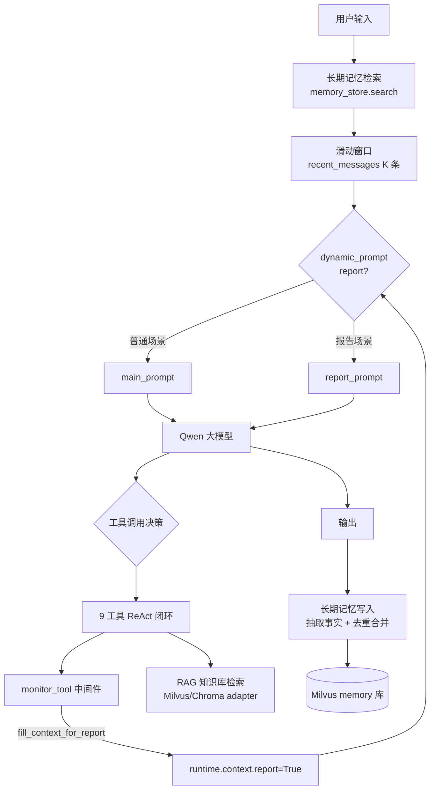
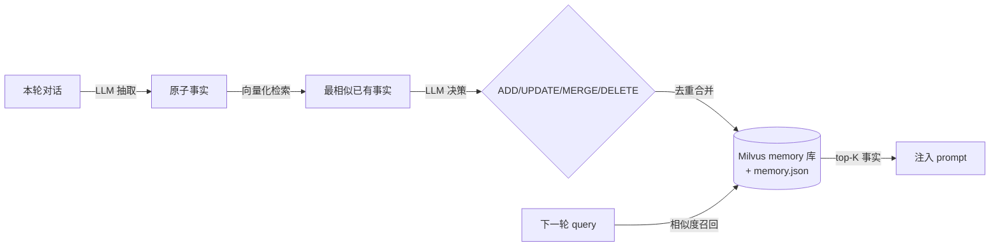

# OpsPilot · 企业 AIOps 智能运维问答系统

基于 LangGraph StateGraph 编排的 ReAct Agent，面向运维场景提供告警分析、监控指标诊断、日志根因定位与系统运行报告生成。核心设计有三：**双场景动态提示词**（`@dynamic_prompt` 按运行时上下文切换系统提示词）、**信号工具显式声明意图**（`fill_context_for_report` 空操作工具 + 中间件拦截，让 Agent 自主声明"我要进入报告场景"）、**借鉴 mem0 的两阶段长期记忆层**（事实抽取 + 去重合并 + 相似度召回）。

## 架构



## 核心特性

### 1. 双场景动态提示词（`@dynamic_prompt`）

普通问答与报告生成是两种截然不同的输出范式。通过 `@dynamic_prompt` 中间件 `report_prompt_switch`，每次模型调用前读取 `runtime.context["report"]`，在 `main_prompt`（运维问答）与 `report_prompt`（结构化报告）间切换系统提示词，无需维护两个 Agent。

### 2. 信号工具设计：`fill_context_for_report`（最有讲头）

报告场景的触发不是靠关键词匹配，而是让 Agent **主动调用一个空操作工具来声明意图**：

- `fill_context_for_report` 是一个无入参、无实际副作用的 `@tool`
- `monitor_tool`（`@wrap_tool_call`）中间件拦截到该工具调用后，置 `runtime.context["report"] = True`
- 下一轮 `@dynamic_prompt` 据此切换到报告提示词

这种"用工具调用显式声明场景 + 中间件拦截切换"的设计，把"场景识别"从脆弱的自然语言判断变成了确定的工具调用信号，可观测、可测试、可扩展到更多场景。

### 3. 9 工具 ReAct 闭环

| 工具 | 作用 |
|---|---|
| `rag_summarize` | 向量库检索运维知识 |
| `get_target_service` / `get_time_range` | 补全分析目标（服务名/时间范围） |
| `fetch_alert_data` | 告警信息 |
| `fetch_metric_data` | CPU/内存/QPS/RT/错误率等监控指标 |
| `fetch_log_summary` | 高频错误与日志摘要 |
| `fetch_service_topology` | 上下游依赖与中间件拓扑 |
| `fetch_report_data` | 聚合报告数据 |
| `fill_context_for_report` | 信号工具，触发报告场景 |

数据工具当前对接 mock 数据（`agent_tools.py` 内置），接口已抽象，后续可替换为真实 Prometheus / Elasticsearch / 告警平台数据源。

### 4. 记忆系统（v1 → v2 演进，借鉴 mem0）

记忆分两层，对应短期与长期：

**短期记忆 · 滑动窗口**（`agent/memory.py`）
- `FileChatMessageHistory` 继承 `BaseChatMessageHistory`，按 `session_id` 隔离，JSON 文件持久化，重启不丢失
- `recent_messages(K)` 滑动窗口：每次只取最近 K 条历史喂回模型，全量历史仍完整持久化在文件中，避免长对话 token 膨胀

**长期记忆 · mem0 式两阶段流水线**（`agent/memory_store.py`）

借鉴 [mem0](https://github.com/mem0ai/mem0) 的设计但不引入其完整依赖，自研轻量实现：

- **提取阶段**：每轮对话后，LLM 从最新交流抽取"值得长期记住的原子事实"（用户偏好、决策、关键运维结论如根因定位）
- **更新阶段**：新事实向量化检索最相似的已有事实，LLM 决定四操作之一 —— `ADD`（新信息）/ `UPDATE`（同对象新状态）/ `MERGE`（合并更完整）/ `DELETE`（重复冗余）
- **检索阶段**：下一轮 query 向量化召回 top-K 事实，注入 prompt 作为长期记忆上下文

与 mem0 一致采用 **ADD-only 倾向**：默认追加不覆盖，矛盾事实并存，靠元数据时间戳让新事实在检索时优先呈现，保留完整历史可审计。事实原文以 JSON 为 source of truth，Milvus 向量库作为检索索引。



### 5. 向量库 adapter（Chroma / Milvus Lite 切换）

`rag/vector_store.py` 抽象 `VectorStoreBackend` 接口，`ChromaBackend` 与 `MilvusBackend` 两个实现，由 `config/vector_store.yml` 的 `provider` 字段切换：

- **Milvus Lite**（默认）：`pymilvus >= 2.4.8`，单文件 `.db` 落地，零部署，适合本地与原型
- **Chroma**：对照保留，便于回退

知识库与长期记忆共用同一个 Milvus `.db` 文件，但使用不同 collection（`agent` 知识库 / `agent_memory` 记忆库）隔离。知识库加载沿用 MD5 去重，避免重复向量化。

## 快速开始

```bash
# 1. 克隆并进入项目
git clone <repo-url> aiops-agent
cd aiops-agent

# 2. 创建虚拟环境（需 Python >= 3.10）
python -m venv .venv
# Windows
.venv\Scripts\activate
# macOS / Linux
source .venv/bin/activate

# 3. 安装依赖
pip install -r requirements.txt

# 4. 配置通义千问 API Key（DashScope）
#    ChatTongyi 与 DashScopeEmbeddings 默认读取该环境变量
set DASHSCOPE_API_KEY=sk-your-key-here        # Windows
export DASHSCOPE_API_KEY=sk-your-key-here     # macOS / Linux

# 5. 启动 Streamlit 前端
streamlit run app.py
```

打开浏览器访问终端提示的本地地址，常用问题示例：

- 分析一下 order-service 最近1小时的异常情况
- payment-service 今天有什么主要告警
- 生成 inventory-service 本月运行报告（触发报告场景）
- CPU 使用率过高一般怎么排查

## 配置说明

| 文件 | 作用 |
|---|---|
| `config/agent.yml` | 滑动窗口大小 `memory_window`、长期记忆开关与召回条数 `memory_recall_k` |
| `config/vector_store.yml` | 向量库 `provider`（milvus/chroma）、collection、分片参数、Milvus Lite uri |
| `config/rag.yml` | Qwen 模型名、embedding 模型名 |
| `config/prompt.yml` | 三套提示词文件路径 |

## 项目结构

```
.
├── app.py                    # Streamlit 前端，会话管理与流式输出
├── agent/
│   ├── react_agent.py        # ReAct Agent 编排：滑动窗口 + 记忆注入 + 事实写入
│   ├── memory.py             # 短期记忆：FileChatMessageHistory + 滑动窗口
│   └── memory_store.py       # 长期记忆：mem0 式两阶段流水线
│   └── tools/
│       ├── agent_tools.py    # 9 个 @tool，含信号工具 fill_context_for_report
│       └── middleware.py     # monitor_tool / log_before_model / report_prompt_switch
├── rag/
│   ├── vector_store.py       # 向量库 adapter（Chroma/Milvus）+ MD5 去重加载
│   └── rag_service.py        # RAG 检索 + 模型总结链
├── model/factory.py          # Qwen 与 embedding 工厂
├── prompts/                  # main / report / rag_summarize 三套提示词
├── config/                   # 四份 yml 配置
├── data/                     # 知识库源文件（txt/pdf）
└── utils/                    # 配置加载、路径、日志、文件处理、提示词加载
```

## Roadmap

- **mem0 增量重建**：当前记忆更新采用全量 drop + 重插（v1 简化），后续改为基于主键的增量 upsert，降低大规模事实库的重建开销
- **viking 分层组织**：借鉴 viking 的分层记忆组织与目录递归检索，对事实按主题/服务/时间分层索引，提升大规模记忆库的检索精度与召回效率
- **真实数据源接入**：将 `fetch_*` 工具的 mock 数据替换为 Prometheus / Elasticsearch / 告警平台 API
- **记忆检索评测**：引入 LoCoMo / LongMemEval 思路做记忆召回质量评测

## 技术栈

Python · LangChain 1.x（`create_agent` + middleware 机制）· LangGraph StateGraph · 通义千问 Qwen · Milvus Lite / Chroma · Streamlit
